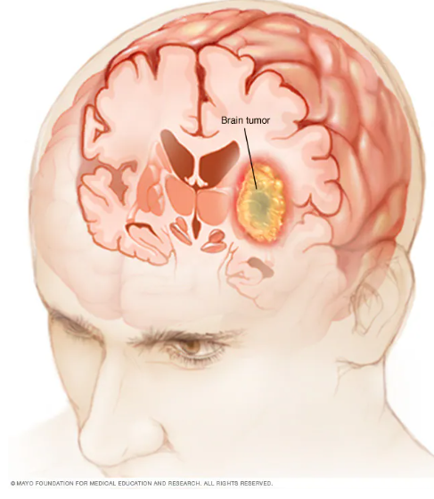
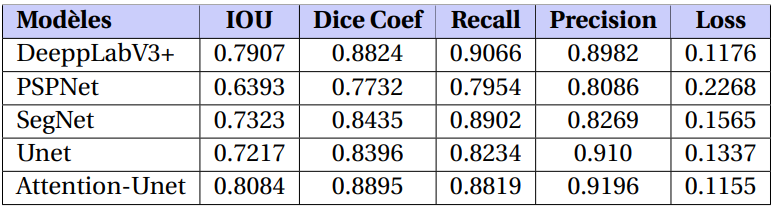
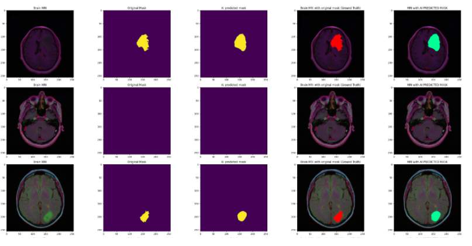

# Brain Tumor Segmentation Using Deep Learning

## Project Overview
This repository contains the work on using deep learning techniques for the automatic detection and precise segmentation of brain tumors from MRI images. Recent advances in deep learning have significantly enhanced the capabilities in medical imaging, particularly in neurology, by providing tools for faster and more accurate identification of brain pathologies.

### Context
Technological advancements in deep learning have revolutionized the detection and segmentation of brain tumors. This project leverages state-of-the-art neural network architectures to improve upon traditional methods by achieving higher accuracy and efficiency.

### Problem Statement
Despite notable advancements, automatic brain tumor segmentation faces significant challenges due to variations in tumor size, shape, and location, as well as differences in imaging characteristics.

### Objectives
The aim of this project is to explore and compare multiple deep learning models for their effectiveness in segmenting and detecting brain tumors from MRI images, evaluating each model's performance under varied conditions.

## Dataset
The models in this study are trained and tested on the "LGG MRI Segmentation Dataset" provided by BUDA, M. (2019). The dataset can be accessed at [Kaggle: LGG MRI Segmentation](https://www.kaggle.com/mateuszbuda/lgg-mri-segmentation).

## Models Explored
- **SegNet**: Utilizes an encoder-decoder architecture, effective in capturing semantic information while preserving spatial details.
- **Attention UNet**: Integrates attention mechanisms focusing on specific regions, enhancing segmentation accuracy.
- **UNet**: A robust model for medical image segmentation with stable performance.
- **DeepLabV3+**: Employs atrous convolutions to capture fine details without compromising segmentation quality.
- **PSPNet**: Uses spatial pyramid pooling to understand structures at multiple scales.

## Model Comparison Results

Above is the comparison of model performances on several metrics such as IOU, Dice Coefficient, Recall, Precision, and Loss. This comparison illustrates that DeepLabV3+ and Attention UNet provide robust results across all metrics, clearly outperforming other models.

## Example SegNet Results

The image above shows an example of the original MRI, the true mask, and the predicted segmentation by the SegNet model, illustrating how the model performs in practice.

## Detailed Comparison in the Report
The project report contains a comprehensive explanation of each model's approach and detailed comparisons using specific segmentation metrics. This in-depth analysis helps to understand the strengths and weaknesses of each architecture in the context of brain tumor segmentation.
The full report available [here](Report.pdf).

## Collaborations
We welcome contributions from researchers and clinicians. If you are interested in collaborating or have suggestions to improve the models, please open an issue or submit a pull request.
